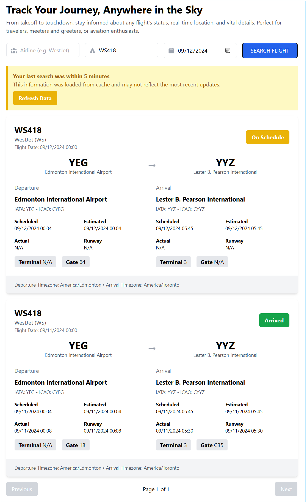

# Flight Tracker

## Track Your Journey, Anywhere in the Sky

This Vue.js application allows users to track flights worldwide, providing real-time information about flight status, departure and arrival details, and more.



## Features

- Search flights by airline, flight number, and date
- Display detailed flight information including:
  - Flight status (e.g., scheduled, active, landed, cancelled)
  - Departure and arrival airport details
  - Scheduled, estimated, and actual times
  - Terminal and gate information
- Pagination for multiple flight results
- Responsive design using Tailwind CSS
- API response caching for improved performance
- Visual indicator for cached data usage
- Option to force refresh cached data

## Prerequisites

Before you begin, ensure you have met the following requirements:

- Node.js (v14.0.0 or later)
- npm (v6.0.0 or later)

## Installation

1. Clone the repository:

   ```
   git clone https://github.com/esoltys/flight-tracker.git
   cd flight-tracker
   ```

2. Install the dependencies:

   ```
   npm install
   ```

3. Create a `.env` file in the root directory and add your AviationStack API key:
   ```
   VUE_APP_AVIATION_STACK_API_KEY=your_api_key_here
   ```

## Usage

To run the application in development mode:

```
npm run serve
```

The application will be available at `http://localhost:8080`.

To build the application for production:

```
npm run build
```

To run the Jest test suite:

```
npm run test:unit
```

## API Integration

This project uses the [AviationStack API](https://aviationstack.com/) to fetch real-time flight data. You'll need to sign up for an API key to use this service.

## Caching

The application implements a simple caching mechanism to improve performance and reduce API calls:

- API responses are cached for 5 minutes
- A visual indicator is shown when displaying cached data
- Users can force a refresh of the data, bypassing the cache

## License

Distributed under the MIT License. See `LICENSE` for more information.

## Acknowledgements

- [Vue.js](https://vuejs.org/)
- [Tailwind CSS](https://tailwindcss.com/)
- [AviationStack API](https://aviationstack.com/)
- [Axios](https://axios-http.com/)
